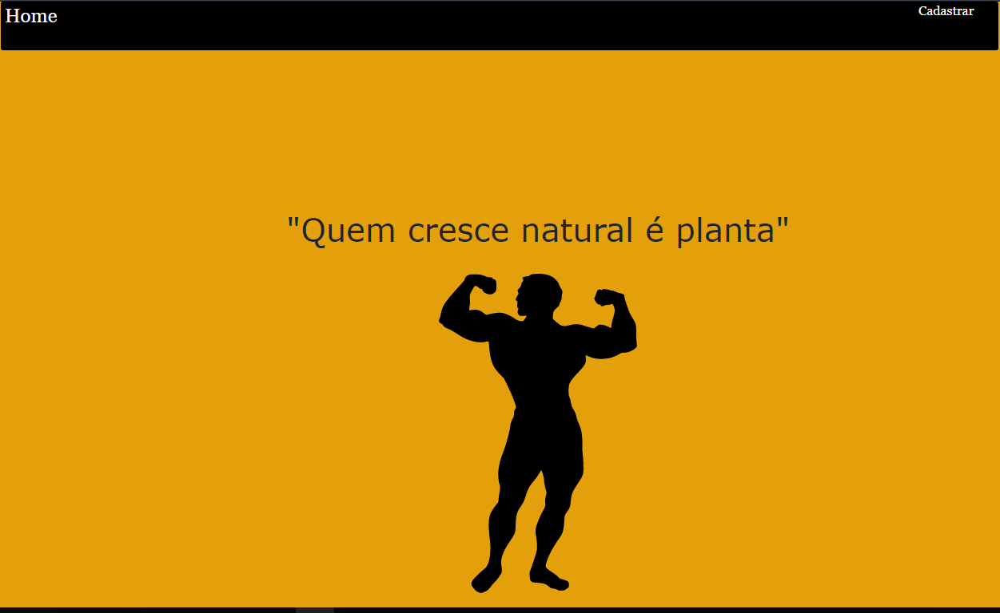

<h1 align="center"> GYM </h1>

Atividade desenvolvida no 2°Bimestre pelo Professor <strong>Diogo</strong>  

  <a href="#-tecnologias">Tecnologias</a>&nbsp;&nbsp;&nbsp;|&nbsp;&nbsp;&nbsp;
  <a href="#memo-licença">Licença</a>

 

  

## 🚀 Tecnologias

Esse projeto foi desenvolvido com as seguintes tecnologias:

- CSS
- JavaScript
- Git e Github
- Figma
- PHP
- MySql

## :memo: Licença

Esse projeto foi criado por: Gabriel Andrade, Caio Augusto e Gabriel Paiva
